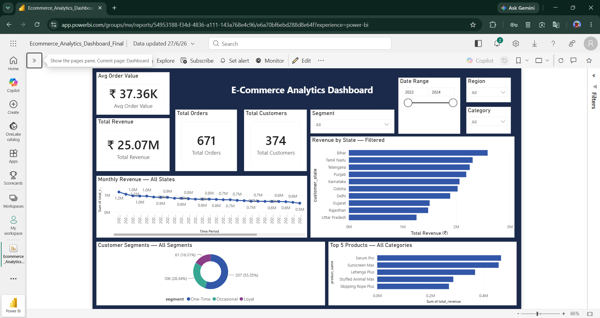
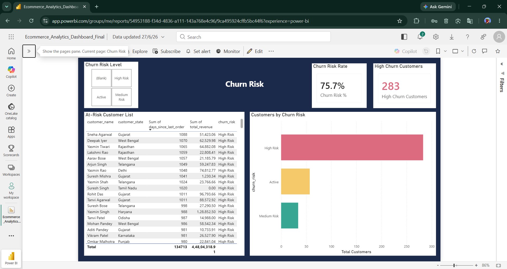
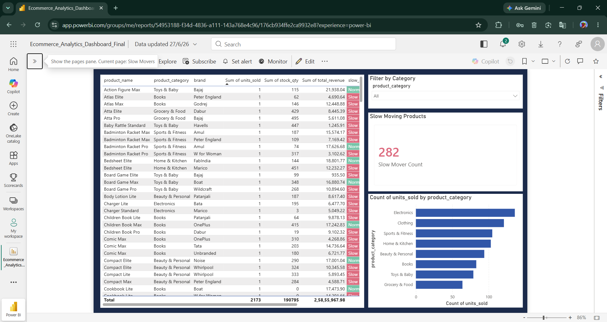
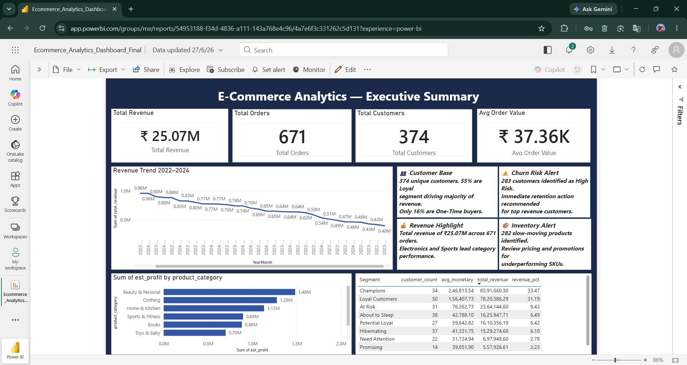
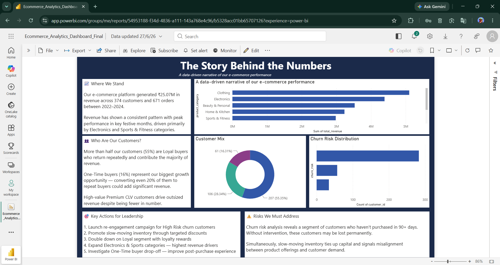

# 🛒 E-Commerce Customer Insights & Analytics Dashboard
### ReadyNest Corp — Machine Learning Internship | Week 2 

## 📌 Project Overview

This project presents a full end-to-end **data analytics pipeline** for an Indian e-commerce platform. Starting from raw synthetic data, it covers data cleaning, feature engineering, customer segmentation, and an interactive multi-page Power BI dashboard — culminating in a business insights report with strategic recommendations.

> **Period Covered:** January 2022 – December 2024  
> **Dataset:** Synthetic Indian E-Commerce data (6 interrelated tables, 374 customers, 785 products)  
> **Tools:** Python · pandas · Jupyter Notebook · Power BI Desktop · DAX

---

## 📊 Key Metrics at a Glance

| Metric | Value |
|--------|-------|
| 💰 Total Revenue | ₹2.51 Crore |
| 📦 Total Orders | 671 |
| 👥 Total Customers | 374 |
| 🧾 Avg Order Value | ₹37,360 |
| ⚠️ High Churn Risk | 283 customers (75.7%) |
| 🐌 Slow-Moving Products | 282 / 785 (35.9%) |
| 🏆 Top Category (Revenue) | Clothing — ₹51.0L |
| 💹 Top Category (Margin) | Beauty & Personal — 42% |

---

## 🗂️ Project Structure

```
📁 ecommerce-analytics/
│
├── 📓 Notebooks/
│   ├── Data_cleaning_and_Preparations.ipynb   # Data cleaning & feature engineering
│   ├── Customer_Analysis.ipynb                # Customer segmentation & CLV analysis
│   ├── Customer_Segmentation.ipynb            # RFM scoring & segment assignment
│   ├── Sales_analysis.ipynb                   # Revenue trends & sales patterns
│   └── Product_Analysis.ipynb                 # Product performance & slow movers
│
├── 📁 Exported_CSVs/                          # Power BI ready data files
│   ├── customer_summary_for_powerbi.csv
│   ├── rfm_customer_segments_powerbi.csv
│   ├── rfm_segment_summary_powerbi.csv
│   ├── monthly_sales_for_powerbi.csv
│   ├── daily_sales_for_powerbi.csv
│   ├── product_summary_for_powerbi.csv
│   ├── category_summary_for_powerbi.csv
│   ├── profit_margin_by_category_powerbi.csv
│   ├── profit_margin_by_state_powerbi.csv
│   ├── churn_risk_powerbi.csv
│   ├── slow_mover_powerbi.csv
│   └── market_basket_powerbi.csv
│
├── 📊 Ecommerce_Analytics_Dashboard.pbix      # Power BI Dashboard file
├── 📄 ReadyNest_Business_Insights_Report.docx # Final business report
└── 📝 README.md
```

---

## 🔄 Pipeline Overview

```
Raw Data Generation
       │
       ▼
Data Cleaning & Preparation (Python/pandas)
  • Null handling  • Type conversion  • Deduplication
       │
       ▼
Feature Engineering
  • RFM Scoring  • CLV Tiers  • Churn Risk Labels  • Slow Mover Flags
       │
       ▼
Exploratory Data Analysis (Jupyter Notebooks)
  • Sales trends  • Category analysis  • Geographic breakdown
       │
       ▼
Export to CSVs (12 analysis-ready files)
       │
       ▼
Power BI Dashboard (6 pages)
  • Data model  • DAX measures  • Interactive visuals
       │
       ▼
Business Insights Report (.docx)
  • 6 sections  • 10 insights  • 5+ recommendations
```

---

## 📓 Notebooks

### 1. `Data_cleaning_and_Preparations.ipynb`
- Loaded and merged 6 raw CSV tables
- Handled missing values in freight, discount, and date columns
- Standardized data types and column naming
- Engineered `YearMonth` composite keys for Power BI joining

### 2. `Customer_Analysis.ipynb`
- Analysed customer purchase frequency and order value distributions
- Computed Customer Lifetime Value (CLV) tiers: Premium, High, Medium, Low
- Identified behavioural segments: Loyal, Occasional, One-Time

### 3. `Customer_Segmentation.ipynb`
- Computed RFM (Recency, Frequency, Monetary) scores (1–5 scale)
- Assigned 9 RFM segments: Champions, Loyal, At Risk, About to Sleep, etc.
- Applied churn risk classification: High Risk (90+ days inactive), Medium, Active

### 4. `Sales_analysis.ipynb`
- Monthly and daily revenue trend analysis
- Geographic revenue breakdown by Indian state
- Payment type distribution and seasonal patterns
- Profit margin analysis by category and state

### 5. `Product_Analysis.ipynb`
- Product-level revenue and units sold analysis
- Slow-mover detection: flagged products with sales < threshold vs stock
- Market basket / co-purchase analysis between categories
- Top 5 products by revenue per category

---

## 📊 Power BI Dashboard

### Pages

| Page | Description |
|------|-------------|
| **Dashboard** | 4 KPI cards + Monthly trend + Top 5 Products + Segment donut + Revenue by State |
| **Region Detail** | Drill-through page — filtered view per state with Back button |
| **Churn Risk** | Churn KPI cards + Risk slicer + At-risk customer table |
| **Slow Movers** | Inventory table with red/green conditional formatting |
| **Executive Summary** | Leadership view — big KPIs + trend + written callouts |
| **Story** | Narrative page — 3 mini charts + business story text |

> 📥 To view the dashboard, download `Ecommerce_Analytics_Dashboard_Final.pbix` and open it in [Power BI Desktop](https://powerbi.microsoft.com/desktop/) (free). All data is embedded — no additional setup required.


### 📸 Dashboard Preview

| Page | Preview |
|------|---------|
| Dashboard |  |
| Churn Risk |  |
| Slow Movers |  |
| Executive Summary |  |
| Story |  |

## 🔗 Live Dashboard

View the interactive dashboard on Power BI:

[](https://app.powerbi.com/links/3f9osctVoC?ctid=f471b67a-c3c8-44df-8d36-5652865ad709&pbi_source=linkShare)

### 📱 Mobile View
A dedicated mobile layout has been designed for the dashboard, optimised for portrait viewing with KPI cards prioritised at the top.

To view on mobile:
1. Download the **Power BI Mobile App** (iOS / Android)
2. Sign in with your Microsoft account
3. Open the report — the mobile layout loads automatically

### Features Implemented
- ✅ Data model with relationships across 12 tables
- ✅ `_Measures` DAX table with 15+ custom measures
- ✅ 4 synced slicers — Date Range, Region, Category, Segment
- ✅ Drill-through — Region Detail with Back button
- ✅ Drill-down — Year → Quarter → Month hierarchy on sales chart
- ✅ Dynamic chart titles using DAX `TitleMeasure` + conditional formatting
- ✅ Sales Forecasting — 3 months, 95% confidence interval (Analytics pane)
- ✅ Conditional formatting — red for slow movers, risk-color bars
- ✅ Mobile layout — portrait view, KPI cards prioritised


### DAX Measures (Selected)
```dax
Total Sales = SUM(MonthlySales[total_revenue])

Churn Risk % = DIVIDE([High Churn Customers], [Total Customers], 0)

MoM Growth = 
VAR CurrentMonth = [Total Sales]
VAR PrevMonth = CALCULATE([Total Sales], DATEADD(DateTable[Date], -1, MONTH))
RETURN DIVIDE(CurrentMonth - PrevMonth, PrevMonth, 0)

TitleRevenueTrend = 
"Monthly Revenue" & 
IF(ISFILTERED(MonthlySales[customer_state]),
   " — " & SELECTEDVALUE(MonthlySales[customer_state], "Multiple"),
   " — All States")
```

---

## 📈 Key Insights

1. **Revenue Concentration** — 84 customers (22.5%) generate 64.7% of total revenue
2. **One-Time Buyer Problem** — 55.4% of customers have made only one purchase
3. **Critical Churn Risk** — 283 customers (75.7%) classified as High Churn Risk
4. **Electronics Margin Problem** — 2nd highest revenue but only 8% profit margin
5. **Beauty & Personal Best ROI** — 42% margin, highest profitability per rupee
6. **Inventory Bloat** — 35.9% of products are slow-moving
7. **Geographic Concentration** — Top 5 states contribute 60%+ of revenue
8. **Champions Drive Disproportionate Value** — 34 Champions = ₹83.9L (33.5%)
9. **Untapped Mid-Tier Segments** — Potential Loyal + Promising = 41 convertible customers
10. **Grocery Sustainability Question** — 10% margin + high logistics = low strategic value

---

## 💡 Business Recommendations

1. **Win-back campaign** for 283 High Risk churn customers with time-limited offers
2. **Loyalty program** for Champions and Loyal segments to reduce churn probability
3. **Post-purchase nurture sequence** for 207 One-Time buyers (Day 7 / 21 / 45 emails)
4. **Inventory clearance** for 282 slow-moving SKUs through targeted flash sales
5. **Increase Beauty & Personal inventory** — highest margin category, prioritise investment
6. **Review Electronics strategy** — renegotiate supplier costs or shift to premium SKUs
7. **Tier-2 city expansion** — Lucknow, Surat, Coimbatore show emerging demand signals

---

## 🛠️ Tech Stack

| Layer | Tools |
|-------|-------|
| Data Generation | Python · Faker |
| Data Cleaning | Python · pandas · Jupyter Notebook |
| Segmentation | scikit-learn · custom RFM scoring |
| Visualization | Power BI Desktop |
| Measures | DAX |
| Report | Microsoft Word (.docx) |

---

## ⚙️ How to Run

### Notebooks
```bash
# Clone the repo
git clone https://github.com/yourusername/ecommerce-analytics.git
cd ecommerce-analytics

# Install dependencies
pip install pandas numpy matplotlib seaborn scikit-learn faker jupyter

# Launch notebooks
jupyter notebook
```
> Run notebooks in order: Data_cleaning → Customer_Analysis → Customer_Segmentation → Sales_analysis → Product_Analysis

### Power BI Dashboard
1. Download and install [Power BI Desktop](https://powerbi.microsoft.com/desktop/)
2. Open `Ecommerce_Analytics_Dashboard.pbix`
3. If prompted, update data source paths to your local `Exported_CSVs/` folder
4. Refresh data → all visuals will load

---
